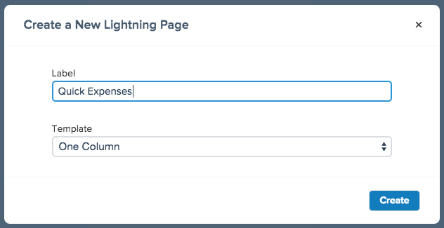
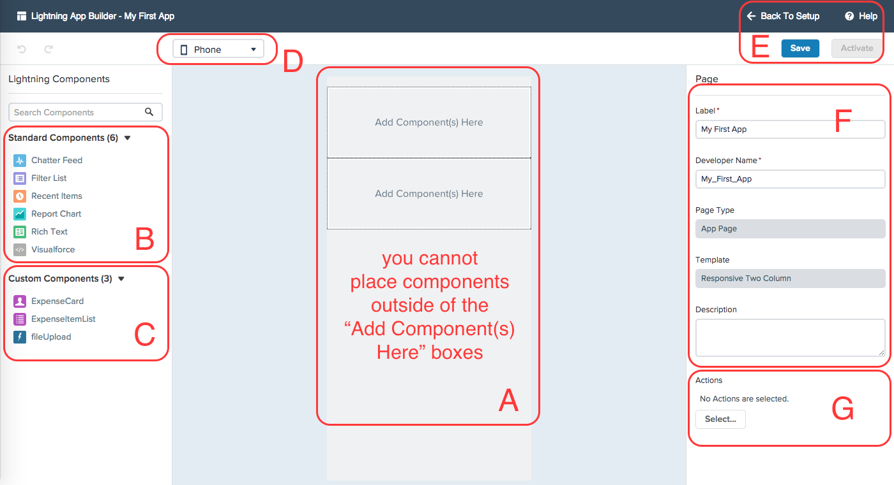

This module gives a quick tour of the Lightning App Builder. You will create a simple app using standard Lightning components, then activate it in  Salesforce1 Mobile. 

## Step 1: Create your first Lightning App in App Builder

> When creating a new Lightning Page you will be presented with a popup. In this popup you will supply a unique name for your new page and select the type of template to use.  
> 
> 
> 
> A template defines the basic behavior and layout of the page you plan to create. Currently these are either _One Column_ or _Responsive Two Column_.  
> 
> Once you have provided the information in the popup the Lightning App Builder then loads, but your page will not save until you click **Save** at least once. 

1. In the **Setup** menu, select ** Build > Lightning App Builder**

2. Click **New** under **Lightning Pages** to start Lightning App Builder

3. In the *Create a New Lightning Page* pop-up, set the following values and click **Create**:

- **Label:** My First App
- **Template:** Responsive Two Column

## Step 2: Tour the Lightning App Builder

You are now in the Lightning App Builder tool which is comprised of the following features:

A. The canvas is the area where you build your app. Apps are assembled by dragging components from the left side bar (see _B_ and _C_) onto the canvas in the center. Editable sections are determined by the template chosen. These sections marked by boxes that initially are labeled _Add Component(s) Here_. Each box can have many components added to it. 

B. Standard Lightning components provided by Salesforce with Lightning App Builder.

C. Custom Lightning components. These will either be built by programmers in your org, deployed using the metadata API or installed from AppExchange packages. 

D. The preview picklist changes the form factor of the canvas so you can get an idea of how your app will display on different devices. Currently you can toggle between *Phone* and *Tablet*. Each template behaves differently when preview mode changes. 

E. Controls for the App Builder. **Save** the current definition of your app. **Activate** adds your app the the Saleforce1 Mobile navigation. **Back To Setup** exits Lightning App Builder and returns you to the list of Lightning Apps. **Help** launches the online help for Lightning App Builder

F. Attributes for the currently selected item. This can either be for the app itself, in which case the title will indicate **Page**. Otherwise you can set attributes for individual components. In this instance the title will indicate **Page > [SelectedComponent]**. 

G. Selected publisher actions for this App. Only global publisher actions are allowed in a Lightning App Builder App. Actions must be defined before you use them in your app by going to **Setup > Create > Global Actions > Actions**.

## Step 3: Build a Simple App Using Standard Components

Now you can use the Lightning App Builder to create a simple app using standard lightning components. 

1. Switch the preview picklist from **Phone** to **Tablet**. This will change the layout of the canvas from the standard single column to the the two column preview.

2. Drag the **Filter List** component from the **Standard Components** in the left hand side bar and place it on the left hand column of the canvas. 

3. In the right side bar look for the attributes to set for this components. Set the following values: 
- **Filter:** My Accounts
- **Number of Records to Display:** 10

4. Drag the **Recent Items** component to the right hand column of the canvas. 

5. Note how the right side bar has now updated with the component attributes and the title now indicates **Page > Recent Items**. In the right side bar set the following values: 
- **Label:** Accounts, Contacts, Expenses
- **Objects:** Click **Select** and drag `Contact` and `Expense` to the *Selected* column on the right then click **Ok**.

6. Click **Save** to save your app. Note that the *Activate* button is now available. 

## Step 4: Activate Your App to Add It To Salesforce1 Mobile

You have created a simple app and saved it. All that remains is to activate it, in order to add it to the Salesforce1 Mobile Application left hand navigation bar. 

>The **Activate** feature allows the application builder to enable the app in the user interface without leaving Lightning App Builder. It bundles the standard Salesforce tab feature normally found at _Setup > Create > Tabs > Lightning Page Tabs_ and automatically adds the tabs to the Salesforce1 Mobile navigation configuration normally found in _Setup > Mobile Administration > Mobile Navigation_. 

1. Click **Activate** to add it to the Salesforce1 Mobile Navigation. 

2. Set **Tab Label** to `First App`.

3. Next to the **Tab Icon** click **Change...**.

4. Select any icon you prefer. This will close the Tab Icon window and change the icon displayed in the Activate window. 

5. In the Salesforce1 Navigation Position Pane on the right, drag the **First App** Salesforce1 Navigation Position to just below the **Feed** navigation. 

6. Click **Activate**.

Your app is ready for testing.

## Step 5: Test in Salesforce1 Mobile

There are several ways you can test your new app.

- If you have the Salesforce1 Mobile app installed on your iOS or Android phone or tablet, you can see it there. Login to your developer org you created in Module 1 on Salesforce1 Mobile. 

- Install the Salesforce1 Simulator [from chrome web store](https://chrome.google.com/webstore/detail/salesforce1-simulator/cknbjckicenodbiaejbmkjhldffonggp) and login to the org you created in Module 1. 

- Using your browser, you can easily access the web UI of Salesforce1 Mobile by going to *instance-name*/one/one.app. For example if your org is on EU5, the url for your org would be https://eu5.salesforce.com/one/one.app. 

Once in Salesforce1 Mobile, open the left hand nav bar by clicking the "hamburger" icon in the upper left. 

You should see your new app. *If you don't, return to Lightning App Builder. Make certain you have saved, and activated*.

- Tap **First App** to see your new app. 
- Tap one of the items in the **My Accounts** list on the left. Notice how it navigates to the record in the standard Salesforce1 user interface. 
- Tap the back arrow at the upper left to go back to your app.  

<a href="Importing-Workshop-Assets.html" class="btn btn-default"><i class="glyphicon glyphicon-chevron-left"></i> Previous</a>
<a href="Build-an-Expenses-App.html" class="btn btn-default pull-right">Next <i class="glyphicon glyphicon-chevron-right"></i></a>

