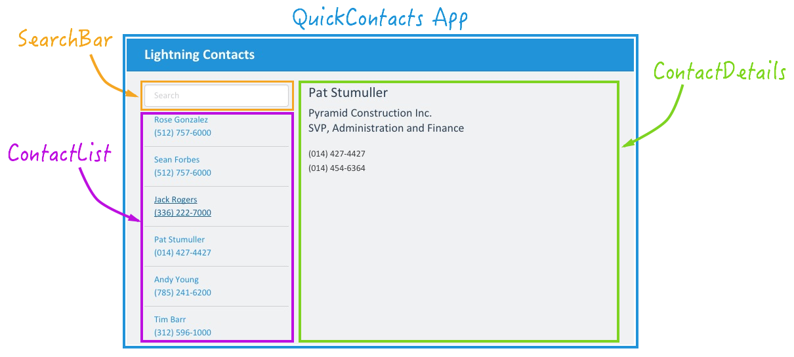

In this tutorial, you use the Lightning App Builder to build an 

## What You Will Learn

- Enable Lightning Components in your Salesforce org
- 

## Browser Requirements

The following browsers are supported when working with Salesforce:

- Most recent version of Google Chrome
- Most recent version of Mozilla Firefox
- Most recent version of Safari
- Internet Explorer 7 or higher
- Additional browser support detailed <a href="https://help.salesforce.com/apex/HTViewHelpDoc?id=getstart_browser_overview.htm" target="_blank">here</a>

## Issues

- Please create an issue <a href="https://github.com/leeanndroid/LightningAppBuilder/issues" target="_blank">here</a> if you run
into any problem or if you have a suggestion to improve this workshop.
- You can also use the Comments section at the bottom of each module to ask a question or report a problem.

<a href="create-developer-edition.html" class="btn btn-default pull-right">Next <i class="glyphicon glyphicon-chevron-right"></i></a>

