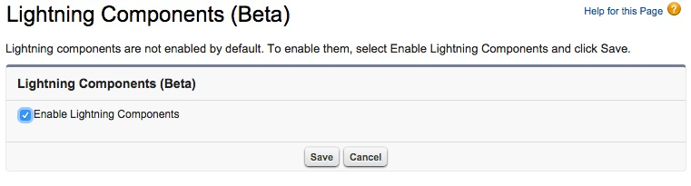

In this module, you set up your environment to enable Lightning App development.

## What you will learn
- Enable Lightning Components in your Salesforce org
- Upload Static Resources for use in your Lightning application
- Install Custom Component

## Step 1: Enable Lightning Components

1. In Setup, click **Develop** > **Lightning Components**

1. Check the **Enable Lightning Components** checkbox

    

1. Click **Save**

## Step 2: Install Custom Component Package 

1. Copy and paste the URL http://bit.ly/NearbyComponent unto the address bar of your browser
1. Select **Continue** on the Package Installation Details screen
1. Select **Next** on the Approve Package API Access screen
1. Select **Grant access to all users** on the Security Level screen. 

1. Select **Next**
1. Select **Install** 

##Step 3: Create Sample Contacts with Locations
All Salesforce developer environments come pre-populated with standard object records. We are going to edit 4 of these existing contact records to add information to our custom geolocation field on the contact record. This will allow our component to map the location of the contacts. 

1. 

<a href="create-developer-edition.html" class="btn btn-default"><i class="glyphicon glyphicon-chevron-left"></i> Previous</a>
<a href="create-apex-controller.html" class="btn btn-default pull-right">Next <i class="glyphicon glyphicon-chevron-right"></i></a>

